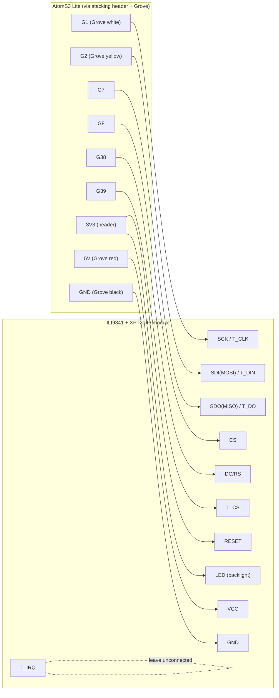
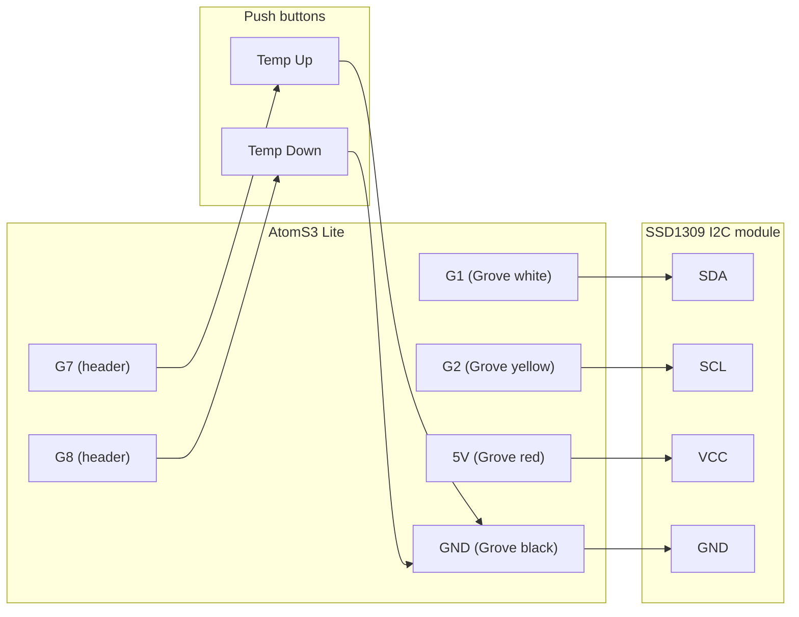

# Wiring: AtomS3 Lite + FOSV Fuji-Atom-Interface + local display

Companion to [example-ili9341-touch.yaml](example-ili9341-touch.yaml) and
[example-ssd1309.yaml](example-ssd1309.yaml).

## Pin budget

The M5Stack AtomS3 Lite exposes:

| Where | Pins |
|---|---|
| Bottom female header | 3V3, G5, G6, G7, G8, G38, G39, GND, 5V |
| Grove (HY2.0-4P) side connector | G1 (white), G2 (yellow), 5V (red), GND (black) |

The [FOSV Fuji-Atom-Interface](https://github.com/FOSV/Fuji-Atom-Interface) base
plugs into the bottom header and uses **G5 (TX)** and **G6 (RX)** for the Fujitsu
bus. The remaining header pins (**3V3, G7, G8, G38, G39**) are seated in the
base's socket but electrically unused.

**To tap the spare header pins**, fit a pass-through stacking header (extra-long
female↔male 2.54 mm header strip) between the AtomS3 Lite and the FOSV base, and
take the display wires from the exposed middle section. Alternatively, solder
wires directly to the unused positions of the FOSV base's header. **Always check
the silkscreen labels** on the FOSV base / Atom before connecting anything.

For **G1/G2**, use a Grove pigtail cable in the side connector.

## Fujitsu bus side (FOSV J3)

| FOSV J3 | Fujitsu terminal | Wire |
|---|---|---|
| 12V | Y1 | Red |
| LIN | Y2 | White |
| GND | Y3 | Black |

Follow the silkscreen on the FOSV base; polarity matters on the 3-wire bus.

## Option A — ILI9341 2.8" SPI TFT + XPT2046 touch

Exactly six free GPIOs are available, and this needs all of them. RESET is tied
high and the touch controller is polled (no IRQ) to save two pins.



| AtomS3 Lite | ILI9341/XPT2046 module | Note |
|---|---|---|
| G1 | SCK **and** T_CLK | shared SPI clock |
| G2 | SDI (MOSI) **and** T_DIN | shared SPI data out |
| G7 | SDO (MISO) **and** T_DO | shared SPI data in (required for touch) |
| G8 | CS | display chip select |
| G38 | DC (RS) | data/command |
| G39 | T_CS | touch chip select |
| 3V3 | RESET | tied high; no reset pin used |
| 3V3 | LED | backlight (most modules have an onboard series resistor; if yours doesn't, add ~100 Ω) |
| 5V | VCC | common red modules have an onboard 3.3 V regulator; if your module is 3.3 V-only (J1 jumper closed), use 3V3 instead |
| GND | GND | |
| — | T_IRQ | leave unconnected (ESPHome polls) |

## Option B — SSD1309/SSD1306 128x64 OLED

### I2C (recommended — Grove connector only, no stacking header needed for the display)



| AtomS3 Lite | OLED / button | Note |
|---|---|---|
| G1 | SDA | |
| G2 | SCL | |
| 5V (Grove) | VCC | most 4-pin I2C modules accept 3.3–5 V; if yours is 3.3 V-only, take 3V3 from the header |
| GND | GND | |
| G7 | Temp Up button → GND | internal pullup, active low |
| G8 | Temp Down button → GND | internal pullup, active low |

The Temp Up/Down buttons use header pins, so they still need the stacking-header
(or soldered) tap. Skip them if you only control via Home Assistant.

### SPI alternative (for SPI-only SSD1309 modules)

Use `ssd1306_spi` instead of `ssd1306_i2c` in the YAML with:

| AtomS3 Lite | OLED |
|---|---|
| G1 | SCK/D0 |
| G2 | MOSI/D1 |
| G7 | CS |
| G8 | DC |
| G38 | RES |
| 3V3 | VCC |
| GND | GND |

This consumes G7/G8, leaving only G39 free — so only one physical button fits;
use Home Assistant (or the AtomS3's front button, G41) for the rest.

## Flashing from WSL

WSL2 has no USB access by default; forward the port with
[usbipd-win](https://github.com/dorssel/usbipd-win) — see the step-by-step in
the project notes / README of your ESPHome setup. Short version:

```powershell
# Windows (admin PowerShell), once:
winget install usbipd
usbipd list                      # find the Espressif / USB Serial device BUSID
usbipd bind --busid <BUSID>      # once per device
usbipd attach --wsl --busid <BUSID>   # after every replug
```

```bash
# WSL:
ls /dev/ttyACM*                  # device should appear
esphome run example-ili9341-touch.yaml --device /dev/ttyACM0
```

If the port doesn't enumerate for the first flash, hold the AtomS3's side reset
button ~2 s until the LED goes green to force the bootloader, then replug/attach.
After the first successful flash, use OTA (`esphome run` with the device on
Wi-Fi) and skip USB entirely.
